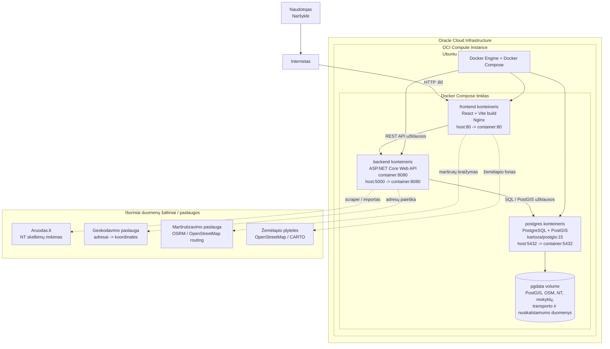

# Diegimo diagrama

Ši schema aprašo `AplinkosRizika` diegimą viename „Oracle Cloud Infrastructure“ virtualiame serveryje, kuriame visi sistemos komponentai paleidžiami per Docker Compose.

## Komponentai

| Komponentas | Technologija | Paskirtis |
| --- | --- | --- |
| `frontend` | React, Vite, Nginx | Naudotojo sąsaja, žemėlapis, analizės puslapiai ir „Analytics Hub“. |
| `backend` | ASP.NET Core Web API | API sluoksnis, NT skelbimų apdorojimas, OSM / PostGIS užklausos, pasiekiamumo ir rekomendacijų skaičiavimai. |
| `postgres` | PostgreSQL + PostGIS | Erdviniai duomenys, OSM lentelės, seniūnijos, nusikalstamumas, mokyklos, transportas ir NT skelbimai. |
| `pgdata` | Docker volume | Nuolatinė duomenų saugykla, kad konteinerių perkūrimas neištrintų duomenų bazės. |

## Diegimo srautas

1. Naudotojas atidaro viešą OCI serverio adresą per `HTTP :80`.
2. `frontend` konteineris per Nginx pateikia sukompiliuotą React aplikaciją.
3. React aplikacija kviečia ASP.NET Core API endpointus.
4. `backend` konteineris jungiasi prie `postgres` konteinerio vidiniu Docker tinklo vardu `postgres`.
5. PostGIS vykdo erdvines užklausas: atstumus, artimiausius objektus, seniūnijų geometrijas ir OSM sluoksnius.
6. Duomenys grąžinami į frontendą kaip JSON ir vaizduojami žemėlapyje bei analitikos puslapiuose.

## Pastabos demonstracijai

- Viešai naudotojams reikalingas tik `frontend` portas `80`.
- `backend` portas pagal dabartinį `docker-compose.yml` yra `5000:8080`.
- `postgres` portas `5432` dabar yra publikuojamas hoste, bet produkciniame pristatyme saugiau jį laikyti pasiekiamą tik Docker tinkle arba riboti per OCI firewall taisykles.
- API ryšys tarp konteinerių vyksta per Docker Compose tinklą, todėl backend duomenų bazę pasiekia per `Host=postgres`.
